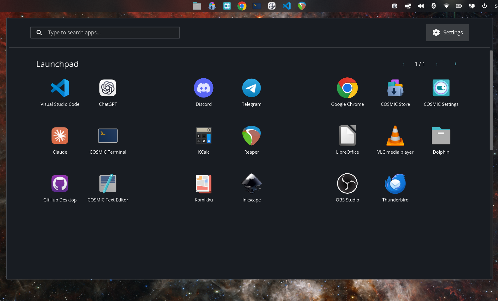
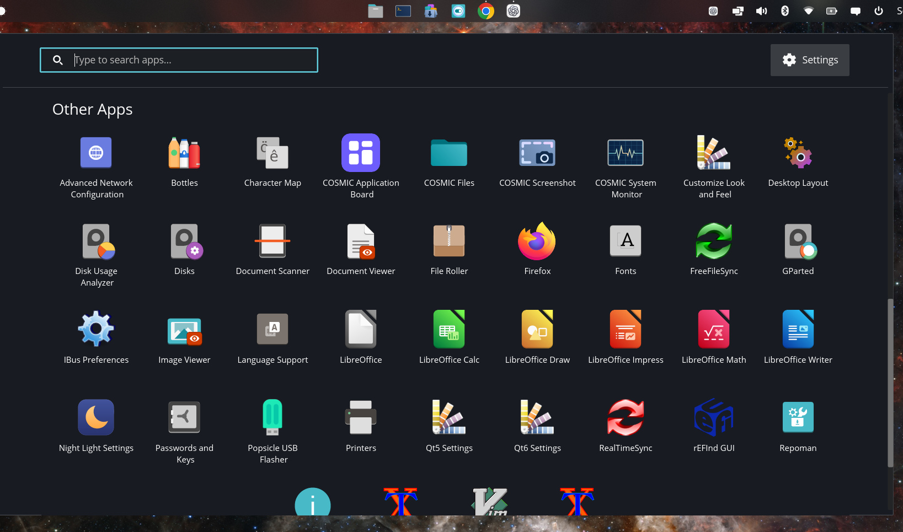
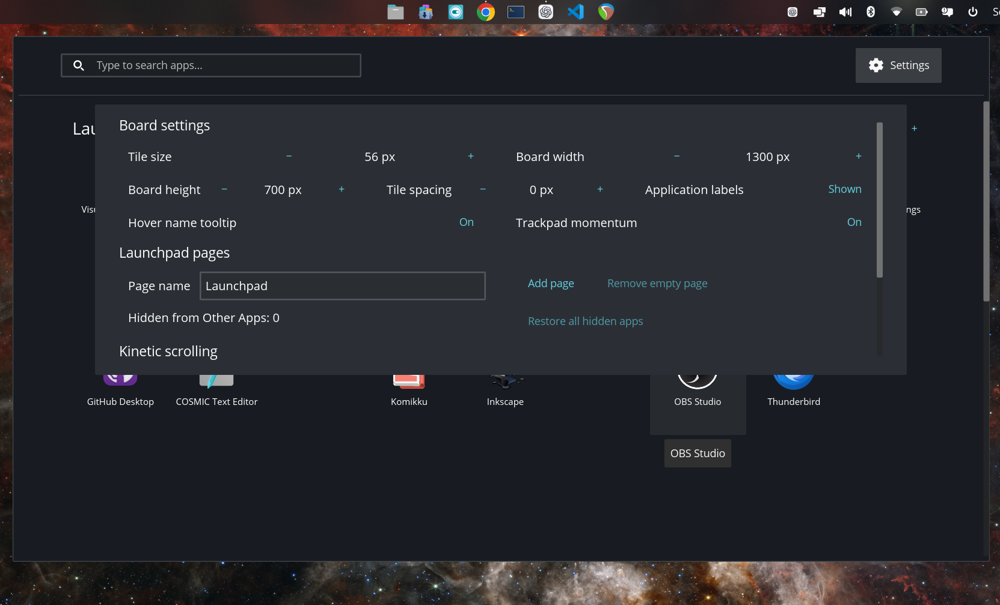

# Cosmic Launchpad

**Place your apps where you want. They stay there.**

Cosmic Launchpad is a customizable spatial application launcher for the COSMIC
desktop. Arrange favorites freely across persistent pages, browse everything else
below, or simply start typing to search.



## Download and install

Choose whichever option works best for you.

### Option 1: Install the `.deb` package

This is the easiest option for most Pop!_OS users.

1. Download [Cosmic Launchpad v1.0.1 for AMD64/x86-64](https://github.com/SigmasonixStudios/cosmic-launchpad/releases/download/v1.0.1/cosmic-launchpad_1.0.1_amd64.deb).
2. Open the downloaded `.deb` file and install it.
3. Open **Cosmic Launchpad** from your applications or add **Launchpad** through
   COSMIC Settings → Desktop → Panel → Applets.

You can also see the [latest GitHub release](https://github.com/SigmasonixStudios/cosmic-launchpad/releases/latest).

### Option 2: Download the source code

Download the [v1.0.1 source code](https://github.com/SigmasonixStudios/cosmic-launchpad/archive/refs/tags/v1.0.1.zip),
extract it, open a terminal in the extracted folder, and run:

```sh
just
sudo just install
```

Building from source requires Rust 1.93 or newer, `just`, `pkg-config`, and the
COSMIC development dependencies. Developers can alternatively clone the repository:

```sh
git clone https://github.com/SigmasonixStudios/cosmic-launchpad.git
cd cosmic-launchpad
just
sudo just install
```

## Why Launchpad?

Most application launchers automatically sort every icon. Launchpad is designed
around spatial memory: you decide where applications belong, and their positions
remain where you placed them.

## Features

- Freely arrange favorite apps on a persistent snapping grid
- Create multiple named Launchpad pages with independent layouts
- Add or remove apps through their right-click menus
- Keep favorites separate from **Other Apps**
- Hide unwanted entries while keeping them searchable
- Start typing anywhere to search instantly
- Open application actions such as New Window or Private Window
- Open an application's page in COSMIC Store
- Configure board size, tile size, spacing, labels, and trackpad momentum
- Use responsive automatic grid sizing
- Add a native Launchpad applet to the COSMIC panel or dock
- Assign the Super key from Launchpad Settings without using the terminal
- Press **Escape** to close Launchpad

## Other Apps

Applications that have not been added to a Launchpad page remain available in a
clean, centered grid below the main board.



## Customization

Launchpad automatically adapts its grid while allowing you to control its
dimensions, tile size, spacing, labels, tooltips, and scrolling behavior.



## Compatibility

The current `.deb` supports **AMD64/x86-64**, including most modern 64-bit Intel
and AMD processors. It does not support 32-bit x86 or ARM systems.

Cosmic Launchpad v1.0.1 is built and tested for **64-bit Pop!_OS running the COSMIC
desktop**. Other distributions or desktop environments may not provide the required
COSMIC libraries and are not currently supported.

## Building a `.deb`

After installing the build dependencies, create a distributable package with:

```sh
just package-deb
```

The package will be written to `target/packages/`.

## Project status

Version 1.0.1 is the current public release. Launchpad is functional, used daily,
and ready for wider testing across more hardware and display configurations.

See [CHANGELOG.md](CHANGELOG.md) for the development history.

## Origin and credit

Cosmic Launchpad began as a modification of
[COSMIC App Library](https://github.com/pop-os/cosmic-app-library), but has since
diverged significantly in design and purpose. The original project was created by
[System76](https://system76.com/) and its contributors. Launchpad uses
[libcosmic](https://github.com/pop-os/libcosmic) to integrate with the COSMIC
desktop.

Thank you to System76 and the COSMIC contributors for building and releasing the
original software and libraries that made this project possible. Cosmic Launchpad
is an independent project and is not an official System76 product.

## License

Cosmic Launchpad is distributed under the
[GNU General Public License v3.0](LICENSE.md), the same license as the project from
which it was derived.
